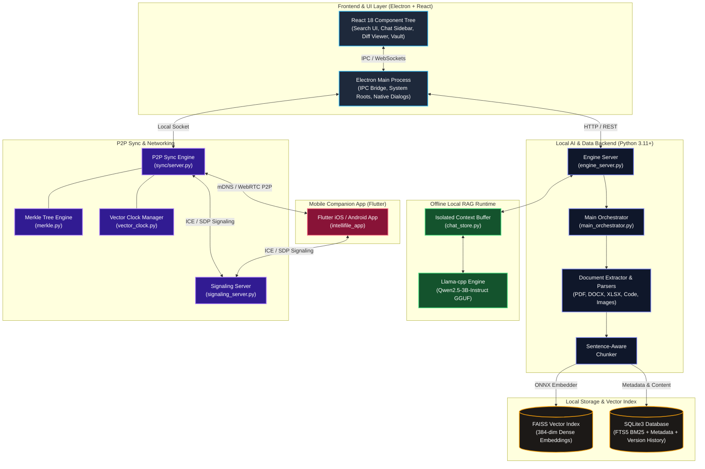

# 🧠 IntelliFile

<div align="center">


**AI-Powered, Privacy-First Local Desktop Search, RAG Document Intelligence & Cross-Device P2P Synchronization Engine**

[](https://github.com/rishivejani15/Intellifile)
[](https://electronjs.org/)
[](https://reactjs.org/)
[](https://python.org)
[](https://flutter.dev)
[](https://onnxruntime.ai/)
[](https://github.com/facebookresearch/faiss)
[](LICENSE)

*Search your entire filesystem using natural language, chat securely with your documents using local LLMs with zero cross-talk or hallucinations, track file versions with format-aware diffing, and sync your workspace across devices P2P—100% offline with zero cloud telemetry.*

</div>

---

## 📋 Table of Contents

- [🌟 Overview](#-overview)
- [✨ Key Features](#-key-features)
- [🏗️ System Architecture](#️-system-architecture)
- [🎯 Mathematical Accuracy & Technical Deep Dive](#-mathematical-accuracy--technical-deep-dive)
  - [1. Hybrid Reciprocal Rank Fusion (RRF)](#1-hybrid-reciprocal-rank-fusion-rrf)
  - [2. SOTA Embedding Model & ONNX Graph Optimization](#2-sota-embedding-model--onnx-graph-optimization)
  - [3. Contextual Sentence-Aware Chunking](#3-contextual-sentence-aware-chunking)
  - [4. Isolated RAG Buffer & Zero-Hallucination Pipeline](#4-isolated-rag-buffer--zero-hallucination-pipeline)
  - [5. Merkle Tree & Vector Clock State Sync](#5-merkle-tree--vector-clock-state-sync)
- [⚡ Performance & Hardware Acceleration](#-performance--hardware-acceleration)
- [📱 Companion Mobile App (`intellifile_app`)](#-companion-mobile-app-intellifile_app)
- [🛠️ Tech Stack Matrix](#️-tech-stack-matrix)
- [🚀 Getting Started](#-getting-started)
  - [Option 1: End-User Standalone Installer (Windows)](#option-1-end-user-standalone-installer-windows)
  - [Option 2: Developer Setup (Running from Source)](#option-2-developer-setup-running-from-source)
- [📦 Frozen Executables & Multi-Stage Packaging](#-frozen-executables--multi-stage-packaging)
- [📂 Repository Directory Map](#-repository-directory-map)
- [🤝 Contributing & License](#-contributing--license)

---

## 🌟 Overview

**IntelliFile** transforms your local desktop environment into an intelligent, privacy-preserving knowledge graph. Instead of struggling to recall exact file paths or literal keywords, IntelliFile allows you to search your computer using natural human language (e.g., *"find last year's Q3 financial projection spreadsheet"* or *"contract NDA terms for client X"*).

Beyond semantic search, IntelliFile lets you open any document and enter an isolated **Chat with File** session powered by quantized local LLMs (`Qwen 2.5 3B / 1.5B`). Furthermore, with built-in **Format-Aware File Diffing**, **Vault File Locking**, and **Peer-to-Peer Cross-Device Sync**, IntelliFile is a comprehensive, production-grade local file management suite.

### 🛡️ Privacy Principles
- **100% Offline Computation:** Zero document contents, vector embeddings, or LLM prompts ever leave your physical device.
- **Zero Telemetry:** No third-party tracking, external API dependencies, or cloud analytics.
- **Air-Gapped Reliability:** Operates completely without an active internet connection once initial setup binaries are initialized.

---

## ✨ Key Features

### 🔍 1. Hybrid Reciprocal Rank Fusion (RRF) Search Engine
Combines three complementary search algorithms into a single rank-fused result list:
- **Dense Vector Search (FAISS):** Semantic similarity matching via 384-dimensional vector embeddings.
- **Keyword Search (SQLite FTS5 - BM25):** Precise string matching for jargon, serial numbers, variable names, and code syntax.
- **Path & Filename Weighting:** Heuristic score boosting based on file hierarchy, path depth, and direct title matches.

### 💬 2. Isolated "Chat with File" Local RAG Pipeline
- Select any document (PDF, DOCX, XLSX, CSV, TXT, MD, Code) and launch a local LLM chat interface.
- Context is strictly fenced to the target document in an isolated temporary memory buffer, eliminating **cross-document context bleed** and preventing hallucinations.
- Powered by `llama-cpp-python` running quantized GGUF models (`Qwen2.5-3B-Instruct` or `Qwen2.5-1.5B-Instruct`).

### 🔄 3. P2P Cross-Device Synchronization
- Keep your files and metadata in sync across devices (PC-to-PC or PC-to-Mobile).
- **LAN Auto-Discovery:** Instant local discovery via mDNS / Bonjour.
- **Remote WebRTC DataChannels:** Direct P2P transport over the internet backed by an isolated WebSocket signaling server.
- **Merkle Tree State Audit:** Incremental delta syncing by verifying cryptographic sub-tree hashes.
- **Vector Clocks:** Robust offline conflict detection and multi-device causal state ordering.

### 📱 4. Companion Mobile App (`intellifile_app`)
- Built with **Flutter** for Android and iOS.
- Connects directly to your desktop host via local WiFi or WebRTC P2P to view, inspect, and sync documents on the go.

### 📊 5. Smart Versioning & Deep File Diffing
- Automatically tracks file mutations and revision history.
- **Format-Aware Engines:**
  - **Excel Diff Engine:** Cell-by-cell matrix comparison and formula changes across `.xlsx`/`.csv` versions.
  - **Word Diff Engine:** Structural paragraph diffing for `.docx` files.
  - **Text & Code Diff Engine:** Git-style inline unified visual diffs (`react-diff-view`).

### 🔐 6. Vault File Locking & Local Security
- Lock sensitive files directly from the UI using native filesystem atomic locks (`file_lock_service.js`).
- Secure Vault File Picker (`VaultFilePicker.jsx`) for restricted document access.

### 🏷️ 7. Smart Auto-Categorization & File Tagging
- Automatically categorizes ingested files into structured categories (Documents, Code, Media, Archives, Financials) using rule-based classifiers and machine learning taggers (`classifier.py`, `tagger.py`, `sort_engine.py`).

---

## 🏗️ System Architecture

IntelliFile is designed as an asynchronous, multi-process architecture decoupling the native UI runtime, local AI/Vector engine, background sync node, and mobile clients:



---

## 🎯 Mathematical Accuracy & Technical Deep Dive

### 1. Hybrid Reciprocal Rank Fusion (RRF)
Relying solely on vector embeddings or keyword search introduces retrieval vulnerabilities. Dense vector models frequently misrank strict alphanumeric strings (e.g. `Invoice_9948A.pdf`), while keyword engines fail to connect conceptual synonyms (e.g., matching "tax return" to "2024_fiscal_filing.pdf").

IntelliFile resolves this by implementing **Reciprocal Rank Fusion (RRF)**:

$$\text{RRF\_Score}(d) = \sum_{m \in M} \frac{w_m}{k + r_m(d)}$$

Where:
- $M = \{\text{FAISS Vector Similarity}, \text{SQLite FTS5 BM25}, \text{Path Hierarchy Boost}\}$
- $r_m(d)$ is the ordinal rank of document $d$ within search modality $m$.
- $k$ is a smoothing constant set to $60$ to mitigate extreme rank outlier dominance.
- $w_m$ represents modality weight ($w_{\text{vector}} = 1.0$, $w_{\text{bm25}} = 0.85$, $w_{\text{path}} = 0.5$).

### 2. SOTA Embedding Model & ONNX Graph Optimization
- **Model Choice:** Bypassed heavy API dependencies in favor of `BAAI/bge-small-en-v1.5`.
- **Dimension:** Produces 384-dimensional dense vectors, achieving top-tier ranking on the MTEB (Massive Text Embedding Benchmark) while keeping RAM consumption under 250MB.
- **ONNX Acceleration:** Exported PyTorch evaluation graphs directly to `onnxruntime` with `CPUExecutionProvider` / `CUDAExecutionProvider` primitives, boosting throughput by **3x to 5x** over standard PyTorch execution.

### 3. Contextual Sentence-Aware Chunking
- Documents are parsed using structure-aware extractors (`pdfplumber`, `python-docx`, `openpyxl`).
- Parsed text is split using sentence boundary recognition into target token windows ($\approx 512$ tokens) with a mandatory $50$-token sliding overlap.
- Structured tabular data (Excel/CSV) is preserved as independent row-header tuples rather than raw continuous text blocks.

### 4. Isolated RAG Buffer & Zero-Hallucination Pipeline
- **Context Bleed Prevention:** Standard desktop search toolkits index all user files into a global RAG context pool, leading to accidental context leaks across unrelated files.
- **Strict Single-Document Context Fencing:** When initiating a "Chat with File" session, IntelliFile dynamically constructs a temporary, isolated vector buffer containing exclusively the target file's chunks.
- **Strict Prompt Enclosure:** System prompts strictly enforce grounded answering:
  > *"Answer the user's question using ONLY the provided document context below. If the information is not present in the context, explicitly respond with 'Information not found in document'."*

### 5. Merkle Tree & Vector Clock State Sync
- **Merkle Tree Auditing:** Filesystem state is represented as a cryptographic Merkle tree of SHA-256 file hashes. Synchronizing devices exchange root hashes; if mismatched, they recurse down sub-tree branches to locate exact mutated nodes in $O(\log N)$ network exchanges.
- **Vector Clocks:** Causal updates are ordered across multi-device setups using vector clock timestamp vectors $V(a)[i]$, guaranteeing deterministic conflict detection during offline edits.

---

## ⚡ Performance & Hardware Acceleration

| Component | Strategy / Technology | Benchmark Result |
| :--- | :--- | :--- |
| **Vector Engine** | In-Memory C++ FAISS Index (`IndexFlatIP`) | $< 5\text{ ms}$ query latency across 50,000 chunks |
| **Keyword Index** | SQLite3 FTS5 with WAL Pragma Tuning | $< 2\text{ ms}$ exact text lookups |
| **Embedding Engine** | ONNX Runtime Graph (`bge-small-en-v1.5`) | $\approx 450\text{ chunks/sec}$ (CPU multi-thread) |
| **LLM Inference** | GGUF Quantization (`Q4_K_M` / `Q5_K_M`) | 35-50 tokens/sec (GPU) / 12-20 tokens/sec (CPU) |
| **Incremental Indexing**| SQLite Hash Delta Invalidation | Multi-millisecond background delta updates |

---

## 📱 Companion Mobile App (`intellifile_app`)

The companion mobile app expands the IntelliFile ecosystem to iOS and Android devices:

- **LAN Synchronization:** Auto-discovers local desktop instances using mDNS multicast services over local WiFi.
- **Remote Sync over WebRTC:** Establishes direct encrypted P2P channels to your desktop across cellular or remote networks via the WebSocket signaling server (`backend/signaling_server.py`).
- **File Inspector & Vault Viewer:** Access, preview, and download synced documents directly on your mobile device.

```bash
# Launch mobile app in dev mode (Flutter SDK required)
cd intellifile_app
flutter pub get
flutter run
```

---

## 🛠️ Tech Stack Matrix

| Layer | Technologies & Libraries |
| :--- | :--- |
| **Desktop Shell** | Electron 41, Node.js 18+, Koffi (Native FFI), Chokidar (FS Watcher) |
| **Frontend UI** | React 18, Custom CSS (Dark Glassmorphism), `react-diff-view`, `qrcode.react`, React Icons |
| **Backend AI Runtime** | Python 3.11, PyInstaller, FastAPI / Custom Engine Server |
| **Vector Search & NLP** | FAISS, ONNX Runtime, HuggingFace Transformers, Sentence-Transformers (`bge-small-en-v1.5`) |
| **Local LLM Engine** | `llama-cpp-python`, `Qwen/Qwen2.5-3B-Instruct-GGUF` |
| **Database & Metadata** | SQLite3, FTS5 Full-Text Search, WAL Mode |
| **Parsers & Extractor** | `pdfplumber`, `python-docx`, `openpyxl`, `pandas`, `BeautifulSoup4` |
| **Networking & P2P** | WebRTC DataChannels (`wrtc`), WebSockets (`ws`), mDNS / Zeroconf (`zeroconf`) |
| **Mobile App** | Flutter 3.x, Dart, WebRTC Flutter SDK |

---

## 🚀 Getting Started

### Option 1: End-User Standalone Installer (Windows)

The simplest way to run IntelliFile on Windows without setting up Python or Node.js environments manually:

1. Download the latest `IntelliFile Setup 1.0.0.exe` from the Releases section.
2. Run the installer.
3. On first launch, the app presents an **Offline Setup Screen** which automatically downloads the required lightweight AI models (`BAAI/bge-small-en-v1.5` and `qwen2.5-3b-instruct-q5_k_m.gguf`) directly to your local `AppData` directory.
4. Click **Index Device** to start indexing your hard drives!

---

### Option 2: Developer Setup (Running from Source)

#### Prerequisites
- **Node.js** 18.0 or higher
- **Python** 3.11 or higher
- **C++ Build Tools / Visual Studio Community** (Required for compiling local `llama-cpp-python` bindings on Windows)
- **Flutter SDK** (Optional, only required if building `intellifile_app`)

#### Step 1: Clone Repository
```bash
git clone https://github.com/rishivejani15/Intellifile.git
cd Intellifile
```

#### Step 2: Setup Python Data Backend
```bash
cd backend
python -m venv .venv

# Activate virtual environment
# Windows PowerShell:
.venv\Scripts\activate
# Linux/macOS:
source .venv/bin/activate

# Install Core Requirements
pip install -r requirements.txt
pip install onnxruntime optimum

# (Optional) For GPU Hardware Acceleration:
# CMAKE_ARGS="-DGGML_CUDA=on" pip install llama-cpp-python --force-reinstall --upgrade --no-cache-dir
```

#### Step 3: Fetch Offline AI Models
Run the automated model setup script to download and convert the vector embedder and local LLM:
```bash
python setup_offline.py
```

#### Step 4: Setup & Launch Frontend App
```bash
cd ../frontend
npm install
npm start
```
*This starts the React development server on `http://localhost:3000` and launches the Electron desktop shell automatically.*

#### Step 5: Launch P2P Sync Server (Optional)
To enable multi-device P2P synchronization:
```bash
# In backend virtual environment:
python backend/signaling_server.py
python sync/server.py
```

---

## 📦 Frozen Executables & Multi-Stage Packaging

For production releases, IntelliFile freezes its Python backends into self-contained C++ executable binaries using PyInstaller, ensuring end-users require **zero local Python installation**.

The root automated build script (`build.ps1`) handles the complete pipeline:

```powershell
# Run the full automated build pipeline (PowerShell):
.\build.ps1
```

### Build Pipeline Stages:
1. **Clean Stage:** Purges stale build outputs and temporary directories.
2. **PyInstaller Stage:** Compiles Python backend components into frozen directories:
   - `engine_server.py` $\rightarrow$ `backend-dist/engine/` (via `backend/intellifile_engine.spec`)
   - `sync/server.py` $\rightarrow$ `sync-dist/server/` (via `backend/intellifile_sync.spec`)
3. **React Build Stage:** Compiles optimized React production assets (`npm run build`).
4. **Electron Packaging:** Packages the Electron shell, frozen backend binaries, and React build using `electron-builder` into a self-contained NSIS Windows installer (`dist/IntelliFile Setup 1.0.0.exe`).

---

## 📂 Repository Directory Map

```
Intellifile/
├── README.md                      # Comprehensive Project Documentation
├── build.ps1                      # Automated Multi-Stage PowerShell Build Script
├── package.json                   # Root Metadata
├── test_model.py                  # Embedding Model Batch Verification Utility
├── test_ort.py                    # ONNX Runtime Inference Verification Utility
│
├── backend/                       # Core Python AI & Data Engine
│   ├── app.py                     # Legacy API Gateway
│   ├── engine_server.py           # Main Asynchronous Engine Server
│   ├── main_orchestrator.py       # Core Pipeline & Search Manager
│   ├── setup_offline.py           # Automated AI Model Downloader & Converter
│   ├── signaling_server.py        # WebRTC Signaling WebSocket Server
│   ├── intellifile_engine.spec    # PyInstaller Spec for Engine Server
│   ├── intellifile_sync.spec      # PyInstaller Spec for Sync Server
│   ├── ai/                        # Local LLM Context & RAG Prompt Handlers
│   ├── chat/                      # Isolated File Chat Memory Store (chat_store.py)
│   ├── core/                      # Model Wrappers & FAISS Vector Store Integrations
│   ├── indexing/                  # File System Extractor & Document Chunking Engine
│   ├── merge/                     # Merge Recommendation & Assistant Logic
│   ├── parsers/                   # Document Extractors (PDF, DOCX, XLSX, CSV, Code)
│   └── utils/                     # SQLite Database Pragma & Cryptographic Hashing Utilities
│
├── frontend/                      # Electron + React Native Desktop Application
│   ├── main.js                    # Electron Main Process & Native IPC Handlers
│   ├── preload.js                 # Context Isolation Preload Bridge
│   ├── sync_engine.js             # Electron Sync Client IPC
│   ├── file_lock_service.js       # Native Desktop File Locking Manager
│   ├── system_roots.js            # Cross-Platform Drive & Directory Enumeration
│   ├── package.json               # Frontend Dependencies & Electron Builder Configuration
│   └── src/                       # React Application Source
│       ├── App.js                 # Top-Level UI Layout & Navigation
│       ├── components/            # UI Components
│       │   ├── ChatSidebar.jsx    # Isolated Chat with File Interface
│       │   ├── FileExplorer/      # Native File Tree & List Views
│       │   ├── FileLockManager.jsx# Vault File Locking Panel
│       │   ├── DiffViewer/        # Format-Aware Excel/Word/Code Diff Viewer
│       │   ├── OfflineSetup.jsx   # Model Setup & Download Wizard
│       │   └── VaultFilePicker.jsx# Secure Restricted Document Selector
│       ├── pages/                 # Full Page Layouts (Search, Vault, Sync, Settings)
│       └── services/              # Client-Side IPC Services
│
├── sync/                          # Cross-Device P2P Synchronization System
│   ├── server.py                  # P2P Node Listener & Sync Daemon
│   ├── merkle.py                  # Merkle Tree State Hash Generator
│   ├── vector_clock.py            # Vector Clock Conflict Resolution Manager
│   ├── checksum.py                # Cryptographic Delta Checksum Verification
│   ├── watcher.py                 # Real-Time Filesystem Change Event Watcher
│   └── mdns.py                    # Multicast DNS Local Network Discovery
│
├── filesystem/                    # Low-Level Local File Store Operations
│   └── local_store.py             # File I/O & Metadata Persistence
│
├── intellifile_app/               # Mobile Companion Application (Flutter)
│   ├── pubspec.yaml               # Flutter Dependencies & Assets Configuration
│   ├── lib/                       # Dart Mobile Source Code (UI & P2P Transports)
│   └── signaling_server.py        # Standalone Signaling Script for Mobile Testing
│
└── tools/                         # Maintenance & Verification Scripts
    └── check_brackets.js          # Syntax & Bracket Validation Helper
```

---

## 🤝 Contributing & License

Contributions are welcome! If you'd like to improve IntelliFile's indexer performance, add new document parsers, or enhance the mobile companion app:

1. Fork the Repository.
2. Create a Feature Branch (`git checkout -b feature/AmazingFeature`).
3. Commit your Changes (`git commit -m 'Add some AmazingFeature'`).
4. Push to the Branch (`git push origin feature/AmazingFeature`).
5. Open a Pull Request.

### License
Distributed under the **MIT License**. See `LICENSE` for more information.

---

<div align="center">
  <sub>Built with ❤️ by <a href="https://github.com/rishivejani15">Rishi Vejani</a> and the IntelliFile Open Source Community.</sub>
</div>
